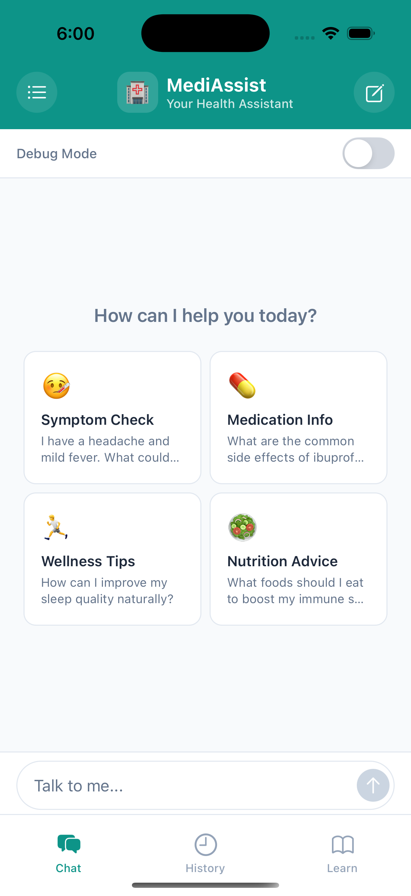
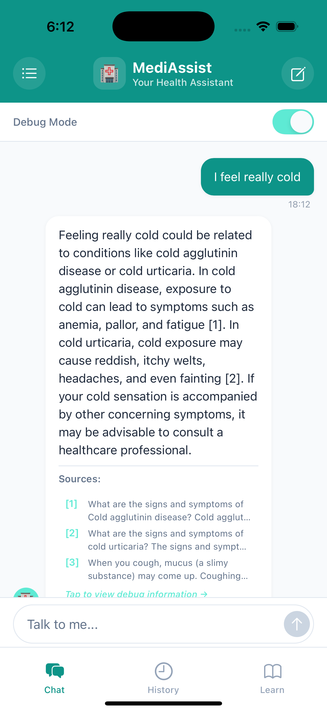
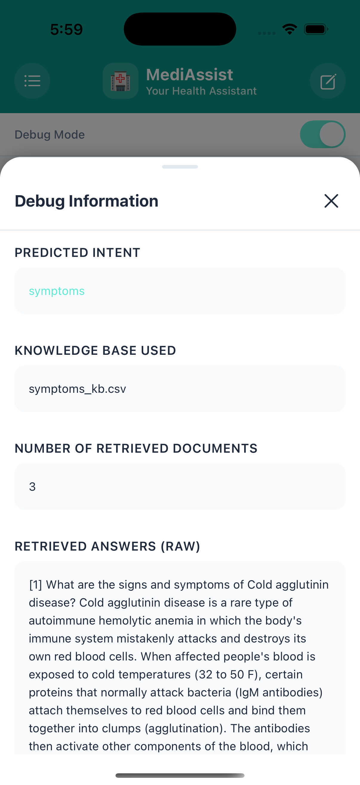
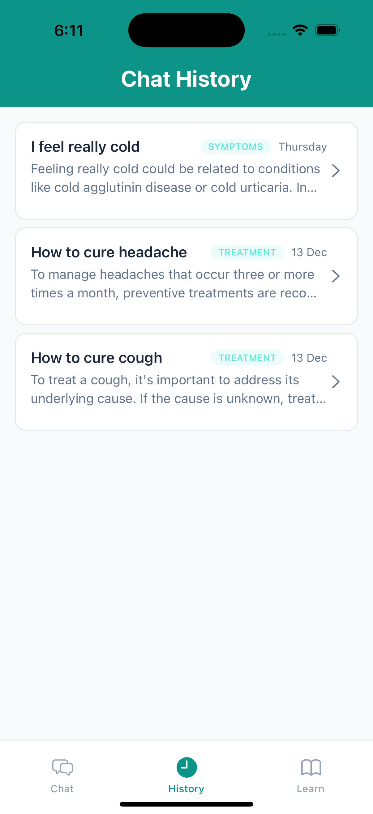
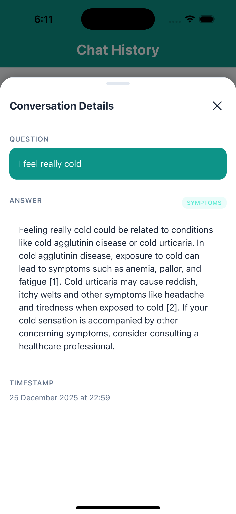

# 🏥 MediAssist - Medical Chatbot Mobile App

<div align="center">

A modern React Native mobile application that provides an intelligent medical chatbot interface powered by RAG (Retrieval-Augmented Generation) technology.

[](https://reactnative.dev/)
[](https://expo.dev/)
[](https://www.typescriptlang.org/)
[]()

</div>

---

## 📋 Table of Contents

- [Features](#-features)
- [Screenshots](#-screenshots)
- [Getting Started](#-getting-started)
- [Project Structure](#️-project-structure)
- [API Integration](#-api-integration)
- [Tech Stack](#-tech-stack)
- [Usage](#-usage)
- [Troubleshooting](#-troubleshooting)

---

## 🏥 Features

### Core Functionality

- 🤖 **Intelligent Medical Chatbot**: Ask medical questions and get AI-powered responses using RAG technology
- 🎯 **Intent Classification**: Automatically categorizes questions into:
  - Symptoms
  - Treatment
  - Causes
  - Prevention
  - Risks
  - Definition
  - Other
- 📚 **Source Citations**: View source documents used to generate answers with citation references

### Advanced Features

- 🔍 **Debug Mode**: Toggle to see how answers are generated
  - View predicted intent
  - See retrieved documents
  - Inspect LLM prompts
  - Check knowledge base used
- 📜 **Chat History**: View and browse past conversations with full details
- 🎨 **Beautiful UI**: Modern, medical-themed design with light/dark mode support
- ⚡ **Real-time Responses**: Fast API integration with comprehensive error handling

## 📱 Screenshots

### Chat Interface


_Main chat interface with AI responses and source citations_

### Debug Mode


_Debug information modal showing intent classification and retrieved documents_

### History View


_Conversation history with intent badges_

### History Detail


_Full conversation details in modal view_

### Additional Feature


_Additional app feature or view_

## 🚀 Getting Started

### Prerequisites

- Node.js (v18 or higher)
- npm or yarn
- Expo CLI (`npm install -g expo-cli`)
- iOS Simulator (for Mac) or Android Emulator
- Backend API running on `http://127.0.0.1:8000`

### Installation

1. **Clone the repository**

   ```bash
   git clone <repository-url>
   cd nlp-chatbot
   ```

2. **Install dependencies**

   ```bash
   npm install
   # or
   yarn install
   ```

3. **Start the Expo development server**

   ```bash
   npm start
   # or
   yarn start
   ```

4. **Run on your preferred platform**
   - Press `i` for iOS simulator
   - Press `a` for Android emulator
   - Scan QR code with Expo Go app on your physical device

## ⚙️ Configuration

### API Configuration

The app connects to a backend API. Update the base URL in `services/api.ts` if needed:

```typescript
const BASE_URL = "http://127.0.0.1:8000";
```

**Note**:

- For iOS Simulator: `http://127.0.0.1:8000` works fine
- For Android Emulator: Use `http://10.0.2.2:8000` instead
- For Physical Devices: Use your computer's local IP address (e.g., `http://192.168.1.100:8000`)

### Environment Setup

Ensure your backend API is running before starting the app. The backend should be accessible at the configured base URL.

## 📖 Usage

### Chat Interface

1. **Ask a Question**: Type your medical question in the input field
2. **Get Answers**: Receive AI-generated responses with source citations
3. **View Sources**: Tap on sources (when debug mode is enabled) to see detailed debug information
4. **Debug Mode**: Toggle the debug switch to see how answers are generated

### History

- View past conversations in the History tab
- Tap any history item to see full conversation details
- Pull down to refresh the history

### Debug Information

When debug mode is enabled:

- Sources section appears below AI responses
- Tap sources to view:
  - Predicted intent
  - Retrieved documents
  - LLM prompt
  - Knowledge base used
  - Number of retrieved documents

## 🏗️ Project Structure

```
nlp-chatbot/
├── app/                    # Expo Router pages
│   ├── (tabs)/            # Tab navigation screens
│   │   ├── index.tsx      # Chat screen
│   │   ├── history.tsx    # History screen
│   │   └── explore.tsx    # Explore screen
│   └── _layout.tsx        # Root layout
├── components/
│   └── chat/              # Chat-related components
│       ├── ChatHeader.tsx
│       ├── ChatInput.tsx
│       ├── ChatMessage.tsx
│       ├── DebugModal.tsx
│       ├── HistoryDetailModal.tsx
│       └── SuggestedPrompts.tsx
├── constants/
│   └── theme.ts           # Theme configuration
├── hooks/                 # Custom React hooks
├── services/
│   └── api.ts             # API service functions
├── types/
│   └── api.ts             # TypeScript type definitions
└── package.json
```

## 🔌 API Integration

### Endpoints

#### POST `/ask`

Ask a medical question to the chatbot.

**Request:**

```json
{
  "question": "What are the symptoms of diabetes?",
  "debug": false
}
```

**Response:**

```json
{
  "intent": "symptoms",
  "answer": "Common symptoms of diabetes include...",
  "sources": [
    {
      "id": 1,
      "text": "Source text..."
    }
  ],
  "debug": null
}
```

#### GET `/history`

Get the last 5 questions and answers.

**Response:**

```json
{
  "user_id": "default_user",
  "history": [
    {
      "question": "What are the symptoms of diabetes?",
      "answer": "Common symptoms include...",
      "intent": "symptoms",
      "timestamp": "2024-01-15T10:30:00.000000"
    }
  ]
}
```

See `services/api.ts` for implementation details.

## 🛠️ Tech Stack

### Frontend

- **Framework**: [React Native](https://reactnative.dev/) with [Expo](https://expo.dev/)
- **Language**: [TypeScript](https://www.typescriptlang.org/)
- **Navigation**: [Expo Router](https://docs.expo.dev/router/introduction/) (file-based routing)
- **State Management**: React Hooks (useState, useCallback, useEffect)
- **Styling**: React Native StyleSheet with custom theme system
- **API Client**: Fetch API with custom error handling

### Backend Integration

- **API**: RESTful API integration
- **RAG Technology**: Retrieval-Augmented Generation for medical Q&A
- **Intent Classification**: ML-based intent detection

## 🎨 Theme

The app features a medical-themed color palette:

- Primary: Teal/Mint tones
- Light/Dark mode support
- Consistent design system

## 📝 Available Scripts

- `npm start` - Start Expo development server
- `npm run android` - Run on Android emulator
- `npm run ios` - Run on iOS simulator
- `npm run web` - Run on web browser
- `npm run lint` - Run ESLint

## 🐛 Troubleshooting

### API Connection Issues

- Ensure the backend API is running
- Check the base URL configuration
- For Android emulator, use `http://10.0.2.2:8000`
- For physical devices, use your computer's local IP

### Build Issues

- Clear node_modules and reinstall: `rm -rf node_modules && npm install`
- Clear Expo cache: `expo start -c`
- Reset project: `npm run reset-project`

## 🎯 Key Highlights

- ✅ **Production-ready** code structure with TypeScript
- ✅ **Comprehensive error handling** for API calls
- ✅ **Debug mode** for transparency in AI responses
- ✅ **Responsive design** with theme support
- ✅ **Clean architecture** with separated concerns
- ✅ **Well-documented** API integration

## 📄 License

This project is private.

## 👥 Contributing

This is a private project. For questions or issues, please contact the repository owner.

## 🙏 Acknowledgments

- Built with [Expo](https://expo.dev)
- Medical chatbot powered by RAG (Retrieval-Augmented Generation) technology
- UI inspired by modern healthcare applications
- Icons provided by [Expo Vector Icons](https://docs.expo.dev/guides/icons/)

---

<div align="center">

**⚠️ Disclaimer**: This app is for educational/demonstration purposes. Always consult healthcare professionals for medical advice.

Made with ❤️ using React Native and Expo

</div>
